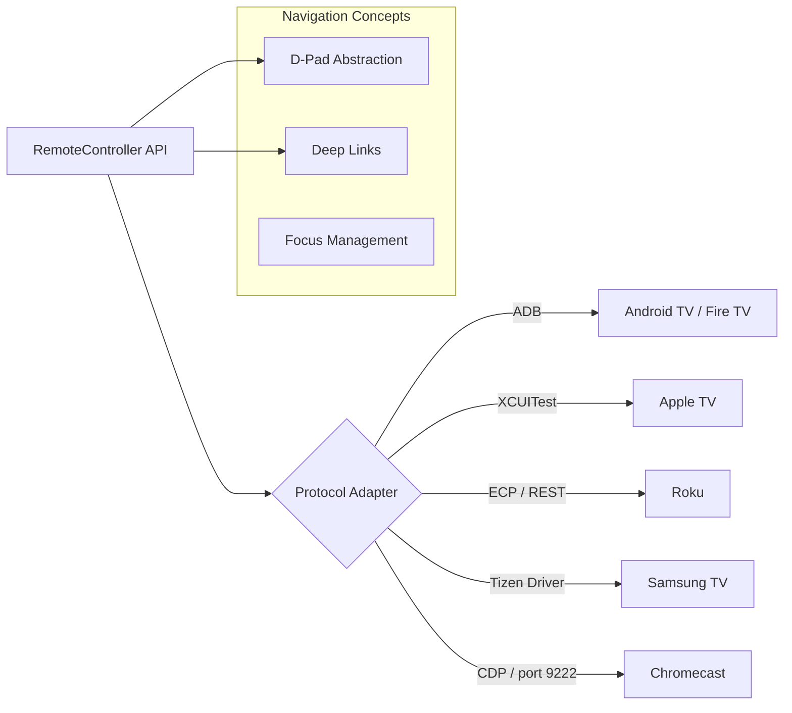

# Video Automation Project (TV)



Advanced multi-platform automation framework for **Big Screen** ecosystems.

## 📺 Ecosystem Coverage
- **Android TV / Fire TV**: Native Appium automation with ADB deep-link integration.
- **Apple TV (tvOS)**: XCUITest automation via Appium with Simulator/Real device support.
- **Roku**: Rest-based control via **ECP (External Control Protocol)**.
- **Samsung Tizen**: Dedicated Tizen Driver integration for web-based Smart TV apps.
- **Chromecast**: Debugger Protocol (CDP) interaction on port 9222 for CAF Receiver apps.

## 🕹 Unified Remote Controller
The framework features a `RemoteController` abstraction that provides a consistent API for D-Pad navigation across all disparite platforms:
- `pressRight()`, `pressLeft()`, `pressUp()`, `pressDown()`
- `pressSelect()`, `back()`, `home()`
- Handling of platform-specific keycodes and REST endpoints transparently.

## 🚀 Key Features & Standards
- **Wait Strategies**: Intelligent polling and visibility checks for heavy TV UI transitions.
- **Localization**: Shared Chapter 14 utilities for multi-language and pseudo-localization verification.
- **Advanced Reporting (Chapter 13)**:
    - **Execution Summaries**: High-level TestNG console output for quick analysis.
    - **Allure Integration**: Visualized results for complex TV navigation flows.

## 🛠 Prerequisites
1.  **JDK 11+** & **Maven**.
2.  **Appium 2.x** with `uiautomator2`, `xcuitest`, and `tizen` drivers.
3.  **Roku**: Developer Mode enabled.
4.  **Chromecast**: CAF Receiver app running with remote debugging enabled.

## 🏃 Running Tests
```bash
# Example executions
mvn clean test -DplatformName=androidtv
mvn clean test -DplatformName=chromecast
mvn clean test -DplatformName=roku
```
